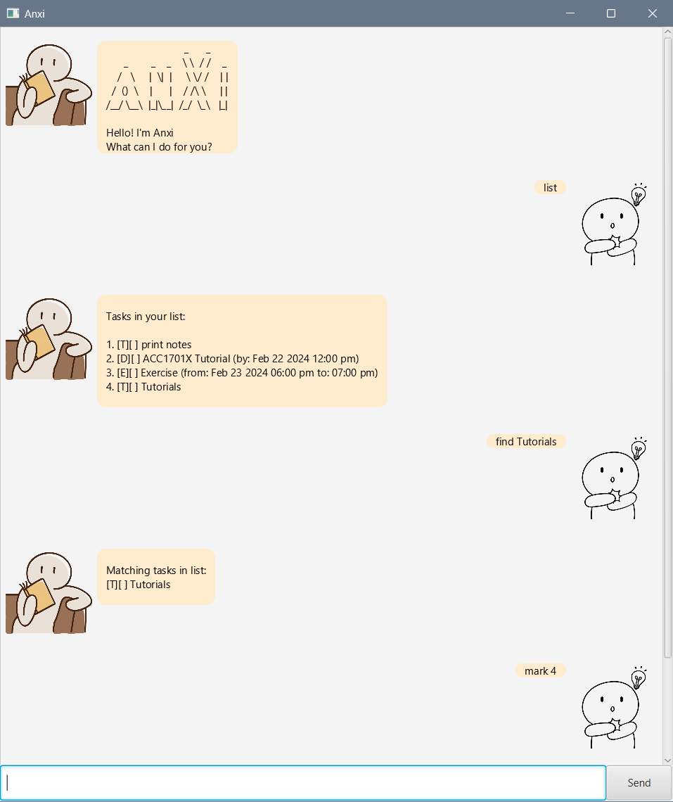

# Anxi User Guide



Too many things to do? Calenders not working? 

Fear not! Anxi the Taskbot is here to help you manage your time! 

## Set up
1. Install java 11
2. Download [Anxi.jar](/build/libs/Anxi.jar)

## Running Anxi
Launch by double-clicking Anxi.jar or call `java -jar Anxi.jar` from terminal.


# Commands
## Listing Tasks
Retrieve the list of all tasks stored in the task list.

Format: `list`

&nbsp;

Example command and expected output:
````
list
------------------------------------------------------------------------------------------------

Tasks in your list:

1. [T][ ] Print notes
2. [D][ ] ACC1701X Tutorial (by: Feb 22 2024 12:00 pm)
3. [E][ ] Exercise (from: Feb 23 2024 06:00 pm to: 07:00 pm)
4. [T][ ] Tutorials
````
&nbsp;


## Adding ToDo's
Add a new ToDo task to the task list.

Format: `todo TASK`
+ `TASK`: The name or a description of the todo task to be added.

&nbsp;

Example command and expected output:
````
todo read book
------------------------------------------------------------------------------------------------

Boo hoo :( added new task.
 [T][ ] read book
5 task(s) in the list.
````
&nbsp;


## Adding Deadlines
Add a new Deadline task to the task list.

Format: `deadline TASK /by DATE_TIME`

+ `TASK`: The name or a description of the deadline to be added.
+ `DATE_TIME`: Date and time the task is due by. 

Note: Refer [here](#accepted-date-and-time-formats) for more information on date and time formats.

&nbsp;

Example command and expected output:
````
deadline return book /by 2024-02-25 09:50 am
------------------------------------------------------------------------------------------------

Boo hoo :( added new task.
 [D][ ] return book (by: Feb 25 2024 09:50 am)
6 task(s) in the list.
````
&nbsp;


## Adding Events

Adds a new Event task to the task list.

Format: `event TASK /from START_DATE_TIME /to END_TIME`

+ `TASK`: The name or a description of the deadline
+ `START_DATE_TIME`: Date and time the event starts. 
+ `END_TIME`: Time the event ends.

Note: Refer [here](#accepted-date-and-time-formats) for more information on date and time formats.

&nbsp;

Example command and expected output:
````
event dinner /from 2024-02-25 1800 /to 1900
------------------------------------------------------------------------------------------------

Boo hoo :( added new task.
 [E][ ] dinner (from: Feb 25 2024 06:00 pm to: 07:00 pm)
7 task(s) in the list.
````
&nbsp;


## Marking Tasks
Mark a task as completed.

Format: `mark INDEX`

+ `INDEX`: The index of the task to mark as completed.

&nbsp;

Example command and expected output:
````
mark 1
------------------------------------------------------------------------------------------------

Marked as done. Good Job!
 [T][X] Print notes
````
&nbsp;


## Un-marking Tasks
Mark a task as uncompleted.

Format: `unmark INDEX`

+ `INDEX`: The index of the task to mark as uncompleted.

&nbsp;

Example command and expected output:
````
unmark 1
------------------------------------------------------------------------------------------------

Such a disappointment. Unmarked the task.
 [T][ ] Print notes
````
&nbsp;


## Deleting Tasks
Delete a task from the task list.

Format: `delete INDEX`

+ `INDEX`: The index of the task to be deleted.

&nbsp;

Example command and expected output:
````
delete 1
------------------------------------------------------------------------------------------------

Farewell task! Task removed from list
 [T][ ] Print notes
6 task(s) in the list.
````
&nbsp;


## Finding keywords
Find tasks that match keyword provided.

Format: `find KEYWORD`

+ `KEYWORD`: Keyword or string to look for in the task list. Case-sensitive.

&nbsp;

Example command and expected output:
````
find Tutorial
------------------------------------------------------------------------------------------------

Matching tasks in list:
[D][ ] ACC1701X Tutorial (by: Feb 22 2024 12:00 pm)
[T][ ] Tutorials
````
&nbsp;


## Viewing Tasks on Specific Date

Format: `view DATE`

+ `DATE`: Date the tasks are due/ are on.

Note: Refer [here](#accepted-date-and-time-formats) for more information on date formats.

&nbsp;

Example command and expected output:
````
view 25/02/2024
------------------------------------------------------------------------------------------------

Events on :
[E][ ] dinner (from: Feb 25 2024 06:00 pm to: 07:00 pm)

Deadlines on :
[D][ ] return book (by: Feb 25 2024 09:50 am)
````
&nbsp;


## Accepted date and time formats
Date formats:
+ `dd-MM-yyyy, MM-dd-yyyy, yyyy-dd-MM, yyyy-MM-dd`
+ `dd/MM/yyyy, MM/dd/yyyy, yyyy/dd/MM, yyyy/MM/dd`

Time formats:
+ `HH:mm, HHmm, hh:mm a`

&nbsp;


## Modifying anxi.txt
Tasks saved to hard disk are stored in anxi.txt. Modifying this file allows users to edit the task list without launching Anxi.

Formats:
+ ToDo: `T | DONE | TASK`
+ Deadline: `D | DONE | TASK | DATE_TIME`
+ Event: `E | DONE | TASK | START_DATE_TIME | END_TIME`

Inputs:
+ `DONE`: 0 if task has not been complete, 1 otherwise.
+ `TASK`: Name or description of the task.
+ `DATE_TIME`: Date and time task is due by.
+ `START_DATE_TIME`: Date and time the event starts.
+ `END_TIME`: Time the event ends.

Note: All dates must be in the format `yyyy-MM-dd` and all timings must be in the format `HH:mm`

&nbsp;

Example:
````
T | 0 | Print notes
D | 0 | ACC1701X Tutorial | 2024-02-22 12:00
E | 0 | Exercise | 2024-02-23 18:00 | 19:00
````